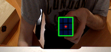
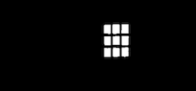

Tracking blue objects with Opencv and Python
======

Opencv is an amazing Open Source Computer Vision Library. Today We're going to hack a little bit with it. The idea is track blue objects. Why blue objects? Maybe becouse I've got a couple of them in my table. Let's start.

The idea is simple. We'll create a mask. Our mask is a black and white image where each blue pixel will turn into a white one and the rest of pixels will be black.

Original frame


masked frame


now we only need put a bounding rectangle around the blue object.

```python
import cv2
import numpy

cam = cv2.VideoCapture(0)
kernel = numpy.ones((5 ,5), numpy.uint8)

while (True):
    ret, frame = cam.read()
    rangomax = numpy.array([255, 50, 50]) # B, G, R
    rangomin = numpy.array([51, 0, 0])
    mask = cv2.inRange(frame, rangomin, rangomax)
    # reduce the noise
    opening = cv2.morphologyEx(mask, cv2.MORPH_OPEN, kernel)

    x, y, w, h = cv2.boundingRect(opening)

    cv2.rectangle(frame, (x, y), (x+w, y + h), (0, 255, 0), 3)
    cv2.circle(frame, (x+w/2, y+h/2), 5, (0, 0, 255), -1)

    cv2.imshow('camera', frame)

    k = cv2.waitKey(1) & 0xFF

    if k == 27:
        break
```

[](https://www.youtube.com/watch?v=7P_D6RTJaJY)

References:
* https://www.youtube.com/watch?v=CppgV8inf7g